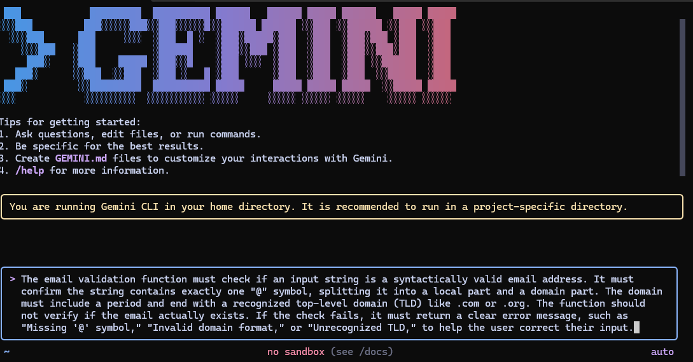

# AIDD 30-Day Challenge — Task 2

## 📁 Part A — Theory (Short Questions)

### 1. Nine Pillars & M-Shaped Development

**Q1: Why is using AI Development Agents (like Gemini CLI) for repetitive setup tasks better for your growth as a system architect?**  
Using AI Agents for repetitive tasks accelerates your growth by shifting focus from manual implementation to **system architecture and specification design**. This transition moves you from being a coder to becoming a strategic system designer.

**Q2: Explain how the Nine Pillars of AIDD help a developer grow into an M-Shaped Developer.**  
The Nine Pillars framework builds an M-Shaped developer by creating **broad competency** across essential domains (Security, DevOps, API Design) while developing **deep expertise** in multiple specialized areas like system architecture and specification writing, forming interconnected skill peaks.

### 2. Vibe Coding vs. Specification-Driven Development

**Q1: Why does Vibe Coding usually create problems after one week?**  
Vibe Coding fails because it lacks planning, resulting in tangled, unmaintainable code that becomes difficult to debug, extend, or understand as complexity grows.

**Q2: How would Specification-Driven Development prevent those problems?**  
Specification-Driven Development prevents issues by enforcing **structured planning before implementation**. The specification serves as a detailed blueprint, ensuring organized, maintainable code that aligns with intended functionality from inception.

### 3. Architecture Thinking in AIDD

**Q1: How does architecture-first thinking change the role of a developer in AIDD?**  
Architecture-first thinking transforms developers from **code implementers to system architects**, focusing on designing robust structures that guide AI implementation rather than writing code line-by-line.

**Q2: Explain why developers must think in layers and systems instead of raw code.**  
Thinking in layers and systems manages complexity through **structured decomposition**, breaking problems into isolated components (API, Database, Cache) that are easier to design, communicate to AI, and modify without cascading failures.

## 📁 Part B — Practical Task

**Task:** Generate a 1-paragraph specification for an email validation function using any AI CLI tool.

**Requirements:**
- Must contain "@"
- Must contain a valid domain (e.g., .com, .org)  
- Should return clear error messages

**Submission:**

1️⃣ **CLI Prompt:**

## 📁 Part C — Multiple Choice Questions

1. **What is the main purpose of Spec-Driven Development?**  
   A. Make coding faster  
   **B. Clear requirements before coding begins**  
   C. Remove developers  
   D. Avoid documentation

2. **What is the biggest mindset shift in AI-Driven Development?**  
   A. Writing more code manually  
   **B. Thinking in systems and clear instructions**  
   C. Memorizing more syntax  
   D. Working without any tools

3. **Biggest failure of Vibe Coding?**  
   A. AI stops responding  
   **B. Architecture becomes hard to extend**  
   C. Code runs slow  
   D. Fewer comments written

4. **Main advantage of using AI CLI agents (like Gemini CLI)?**  
   A. They replace the developer completely  
   **B. Handle repetitive tasks so dev focuses on design & problem-solving**  
   C. Make coding faster but less reliable  
   D. Make coding optional

5. **What defines an M-Shaped Developer?**  
   A. Knows little about everything  
   B. Deep in only one field  
   **C. Deep skills in multiple related domains**  
   D. Works without AI tools