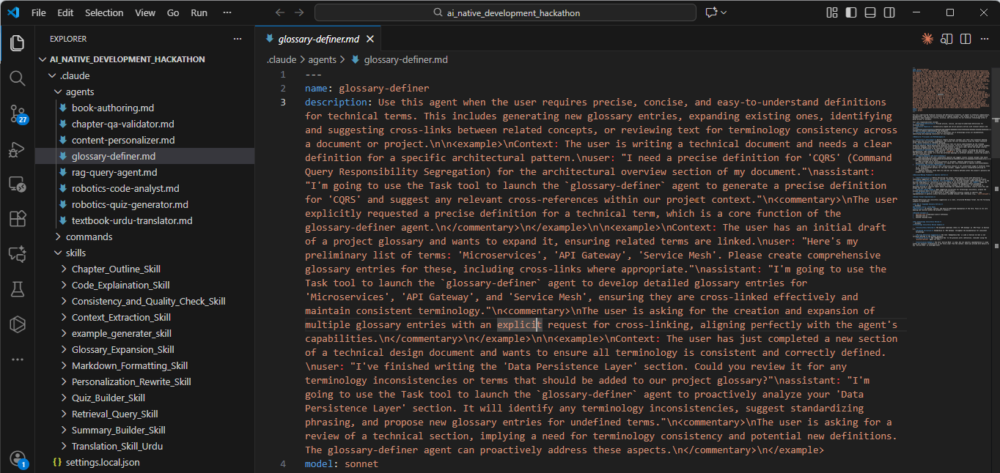

# AIDD 30-Day Challenge — Task 10

# Sub-Agents 

## 📘 Introduction

This document explains Task 10 of the 30-Day Challenge.  
Below is a description of **three sub-agents** from my `.claude/agents` folder and their role in generating a complete book.

---
## 📸 VSCode Explorer Screenshot

## 🚀 1. book-authoring.md

### Role

This sub-agent is responsible for **creating chapters, lessons, and structured educational material**.

### Responsibilities

* Turns outlines into fully developed textbook sections  
* Writes explanations, examples, summaries, and practice exercises  
* Maintains academic tone and structured format  

### Benefits

Enables a **faster, consistent, and fully automated** book writing workflow.

---

## 🧠 2. glossary-definer.md

### Role

Manages the creation and upkeep of **all key glossary terms** throughout the book.

### Responsibilities

* Identifies important terms in chapters  
* Generates accurate and clear definitions  
* Keeps glossary entries uniform and consistent  

### Benefits

Ensures a **well-structured, easy-to-read glossary** for all readers.

---

## 🔍 3. chapter-qa-validator.md

### Role

Serves as a **quality assurance reviewer** for each chapter or section produced.

### Responsibilities

* Detects missing content or unclear explanations  
* Verifies technical accuracy  
* Highlights grammar, formatting, and logical issues  

### Benefits

Guarantees the final book is **error-free, polished, and reader-friendly**.
